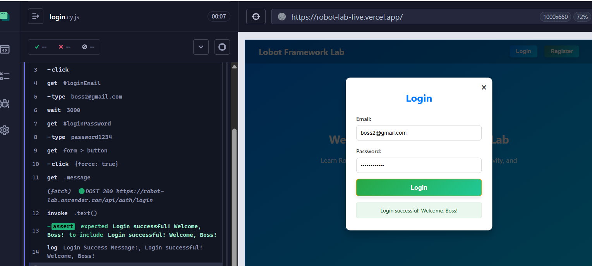
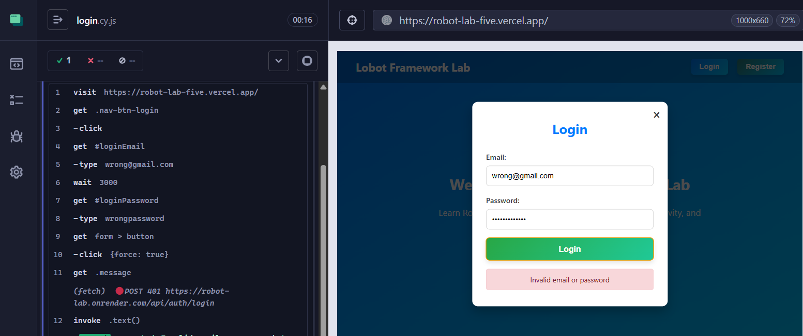
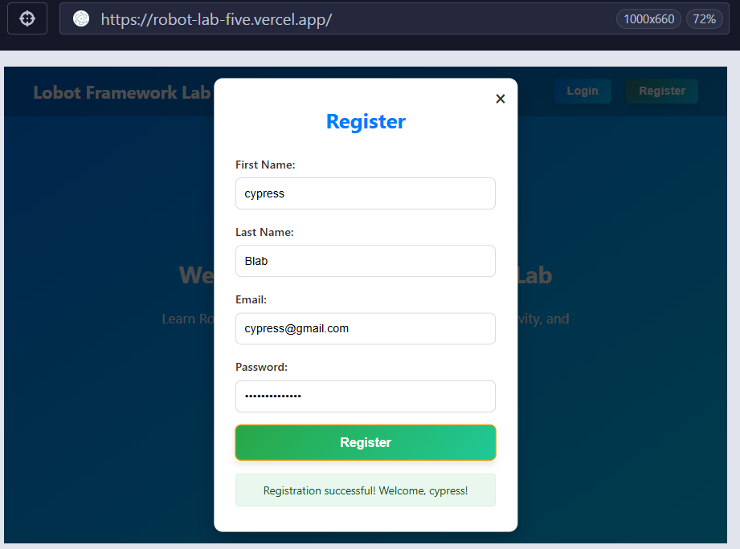
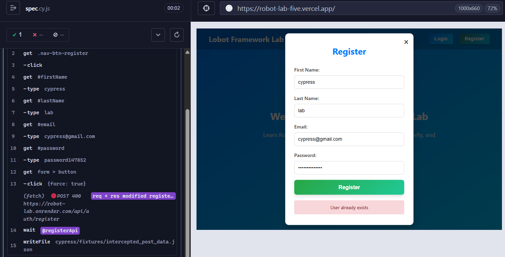
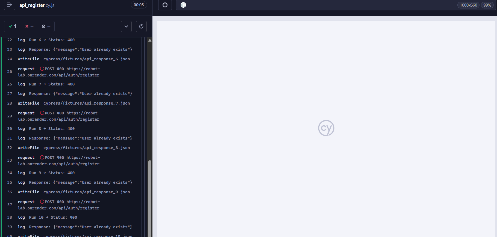
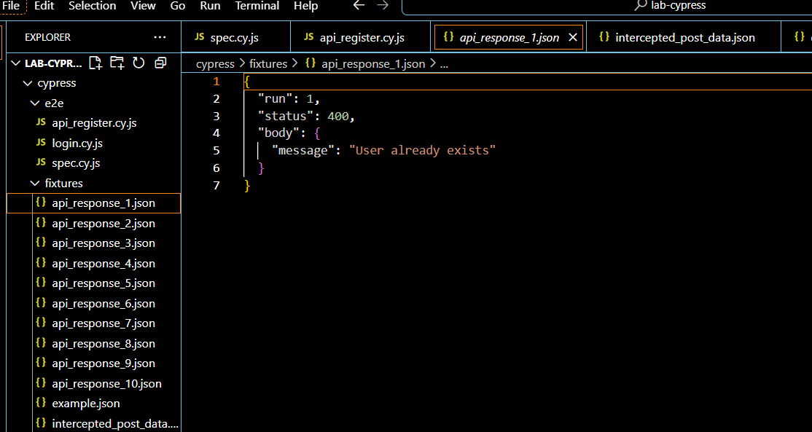
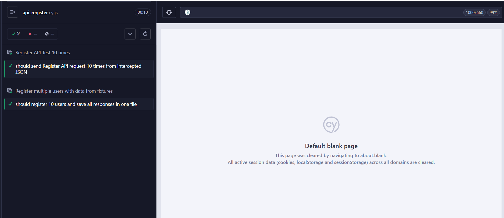

# AutomationCypress
ให้ทำการเขียน Script ทดสอบเว็บ (https://robot-lab-five.vercel.app)

โดยมีรายละเอียดดังนี้
1. ทดสอบการเข้าสู่ระบบวาเข้าสู่ระบบถูกต้องได้หรือไม่พร้อม Cap หน้าจอ
  1.1 มีการเข้าสู่ระบบสำเร็จและไม่สำเร็จ 
  1.2 ถ้าเข้าสู่ระบบสำเร็จ Message ขึ้นว่ายังไง ไม่สำเร็จขึ้นว่ายังไง 
  
  
2. ทดสอบ Api การสมัครสมาชิกว่ามีการยิง ไปที่ url ไหนบ้าง method อะไรบ้างพร้อม Cap หน้าจอ
  
   
  2.1 ใช้คำสั่งดัก Request จากหน้าเว็บแล้ว ทำมาเป็น Json file 
  2.2 เมื่อได้ Json ไฟล์มาแล้วนำมายิง Api 10 รอบ ดูว่าจะเกิดอะไรขึ้นบ้าง
  
  
  2.3 เปลี่ยน Json file ให้ มี ข้อมูล 10 Email ในการทดสอบ 
  
  
